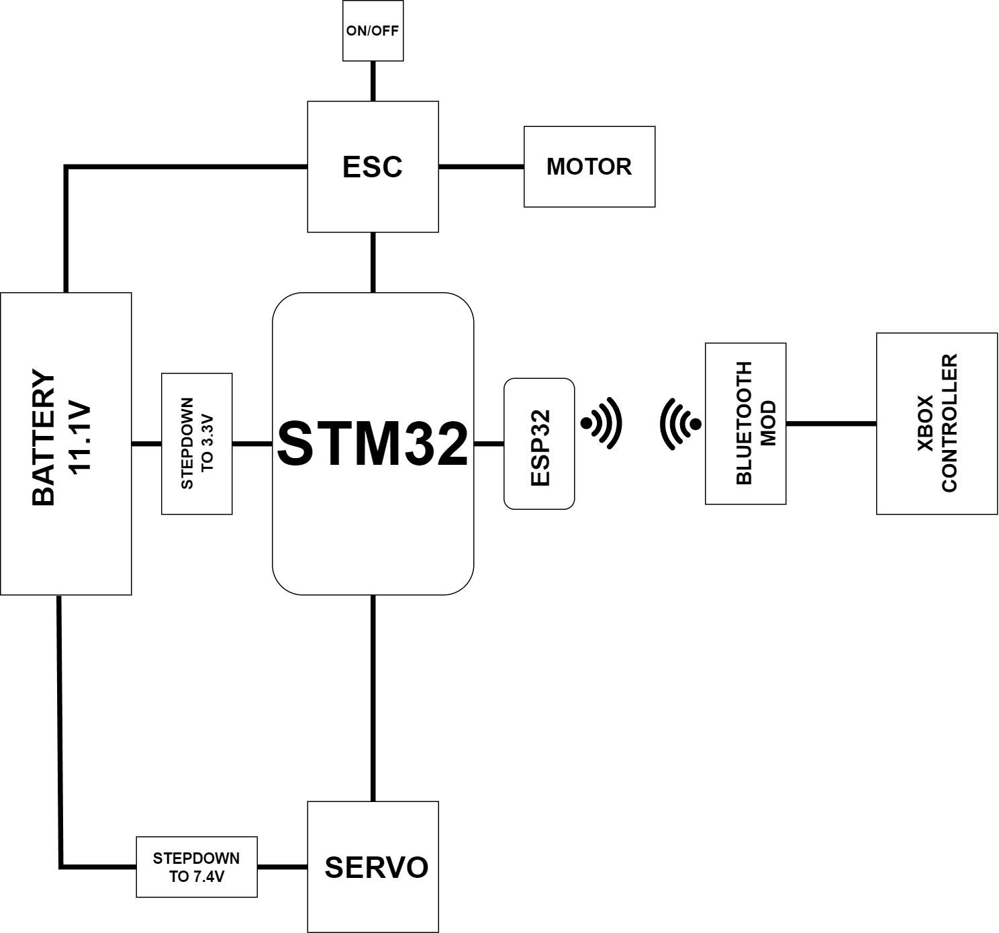

# design_lab S.A.M.O.C.H.O.D.Z.I.K

Welcome to the RC Car University Design Lab project! 🚗🔧

**Project Creators:** Remigiusz Leśny, Michał Glos, Miłosz Nicieja, Bartosz Dźwierzyński 

## Project
  
This project is a collaborative effort within the AGH  university of science and technology 3rd year students of electronics and telecommunications design lab team to create a high-performance RC car. Our goal is to design and implement cutting-edge technologies, making this RC car a showcase of innovation and engineering excellence.

## Schematic diagram

## About 

The world of Remote-Controlled (RC) cars is a captivating realm where miniature engineering meets the thrill of precision control. As we delve into the schematic representation of an RC car, we uncover the intricacies that define these dynamic machines. From the robust chassis that forms the vehicle's backbone to the sophisticated electronic components governing its every move, this schematic is a key to unraveling the mechanical symphony that powers RC car enthusiasts' excitement. By dissecting the various elements in this design, we embark on a journey that not only unveils the technical sophistication of these vehicles but also underscores the fusion of technology and recreation that makes RC cars a beloved pursuit. Join us as we navigate the blueprint of an RC car, exploring the synergy between electronics, software and mechanics that brings this miniature wonder to life.

## What is included in the S.A.M.O.C.H.O.D.Z.I.K
**Chassis:** 
  The main frame of the RC car, often made of lightweight materials like aluminum or carbon fiber.
**Power Source:**
  **Battery:** Typically a rechargeable lithium-polymer (LiPo) battery, providing power to the electric motor.
  **ESC (Electronic Speed Controller):** Regulates the speed and direction of the electric motor based on input from the transmitter.
**Motor:**
  An electric motor that converts electrical energy from the battery into mechanical energy to drive the wheels.
**Receiver (ESP32 for the time being) :**  
  Receives signals from the transmitter and relays them to the ESC, controlling the car's speed and direction. 
**Transmitter:**
  Handheld controller with joysticks and buttons to send signals to the receiver, allowing the user to control the car.
**Suspension System:**
  Shock absorbers and springs that provide flexibility to the wheels, enhancing stability and maneuverability.
**Wheels and Tires:**
  The wheels are attached to axles connected to the transmission. The tires provide traction and grip.
**Steering System:**
  **Servo:** Motorized component that controls the steering mechanism in response to input from the transmitter.
  **Steering Linkages:** Connects the servo to the front wheels, directing their movement.
**central unit (STM32L4):**
  Allows Us to modify signals received via reciever and alter them in any shape or form. Adds an infinite number of ways to modify our vehicle, especially enables advanced use of IMU.
**IMU:**
  It is an electronic device or sensor system that measures and reports a body's specific force (acceleration) and angular rate.

